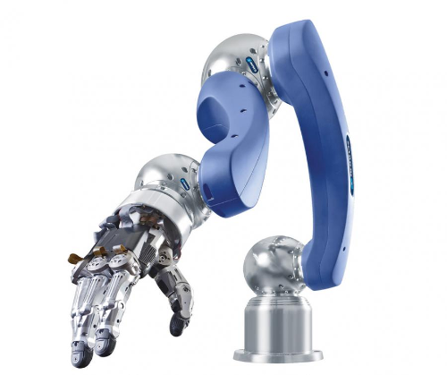
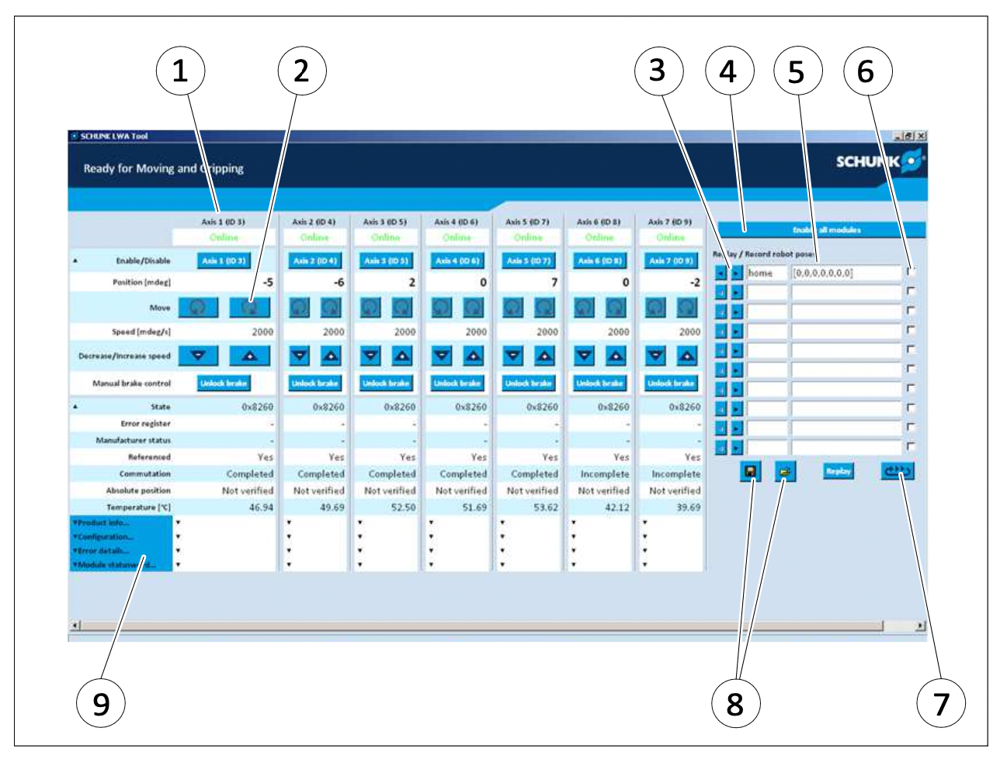
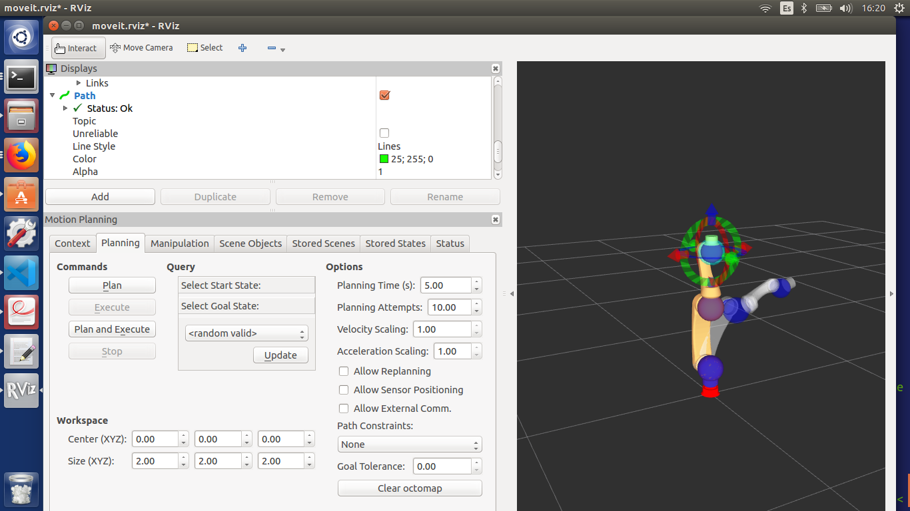
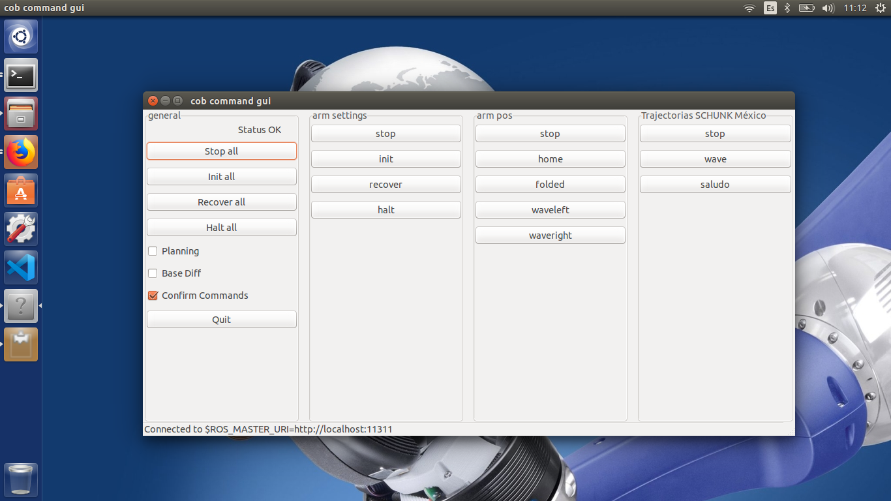
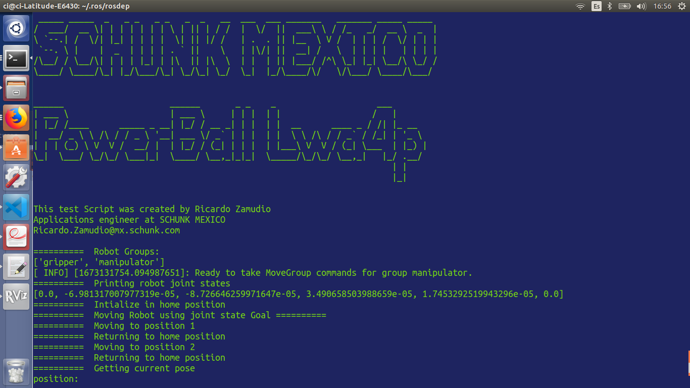
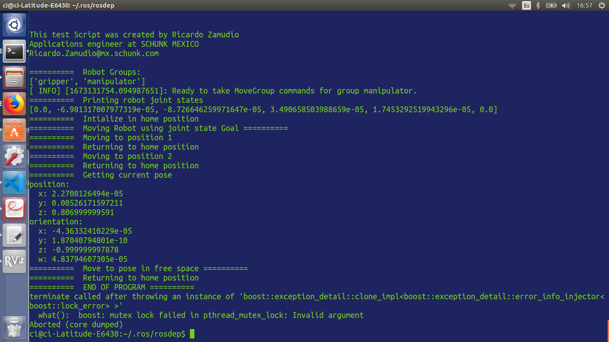

# **Lwa4p Guide**

## Knowledge Base to set-up and initialize SCHUNK'S Lwa4p 6 DOF Robot arm



This repository includes and offers key information to install useful software to use the legacy Lwa4p robot as some of the official information sources are not available in 2022 (year of creation of this repository).

- Robot’s assembly and operation manual
- LWA Software for windows
- Robot set-up in Ubuntu 14.04 and ROS Indigo.

## **Robot's assembly and operation manual**

The Lwa4p 6 DOF Robot lightweight articulated robot is mainly composed by three actuators, two ERB 145 and one ERB 115.

The operations and assembly manual .PDF file can be found in the _**"manual"**_ directory as the [Schunk_Powerball_LWA4P.PDF](./manual/Schunk_Powerball_LWA4P.PDF)

### Basic Robot information

| Data                                |                                             Desc.                                              |
| ----------------------------------- | :--------------------------------------------------------------------------------------------: |
| ID                                  |                                            0306960                                             |
| Number of axes                      |                                               6                                                |
| Max. load [kg]                      |                                3 to 6 (depending on deflection)                                |
| Weight [kg], without base with base |                                             12, 15                                             |
| Repeatability [mm]                  |                                             ±0.15                                              |
| Position feedback                   |                               Pseudo-absolute position measuring                               |
| Drives                              |                       Brushless servomotors with permanent- magnet brake                       |
| Nominal voltage [VDC]               |                                           24.0 ± 5%                                            |
| Nominal power current [A]           |                                               5                                                |
| Max. current [A]                    |                                               14                                               |
| Interface                           | CAN bus (Protocol: CANopen CiA DS402:IEC61800-7-201), two lines are also provided for signals. |

## **LWA Software for Windows**


For basic testing SCHUNK used to provide a windows executable application. Before using the software it must be consulted witch CAN Open to USB adapter is being used and the driver must be installed to allow the software recognize the device.

More information of this software is adressed in the chapter **6 Commissioning** in the operations and assembly manual.

**SOFTWARE FILES** 📂

The executable and files can in be acces in the _LWA_Software_ directory inside this repository and contained in the _CANopenToolsExt_.

To run the software open the **_LWA_Tool.exe_** ⬅️

**Some options for CAN - USB device:**

- _PCAN-USB_ - more info and drivers: [PCAN-USB Manufacturer web page](https://www.peak-system.com/PCAN-USB.199.0.html?&L=1)
- _CAN-USB/2_ - more info and drivers: [CAN-USB/2 Manufacturer web page](https://esd.eu/produkte/can-usb-2) The driver installer can be found as _Treiber Windows_ and contained in the _can_usb2_win64_271.zip_

#### **Software disclaimer from SCHUNK** ❗️❗️

_This software is for demonstration purposes only!_

**The purpose of the program is to:**

- Display basic configuration information of the nodes
- Allow for simple interactive movements of the nodes
- Permit basic recording of points for replay in point to point movements

**The program does NOT:**

- Check for internal or external collisions while moving
- Provide any kind of crtesian control
- Provide any kind of safety related functionality

## **Robot set-up in Ubuntu 14.04 and ROS Indigo.**

The next section contains information from Ammar Najjar repo.

### Choosing CAN Card/Driver

As lwa4p robot arm uses CAN-bus communication protocol, a CAN card is needed to connect to the arm.
In another [project](http://www.cs.rpi.edu/foswiki/bin/view/RoboticsWeb/PowerballSchunk), Bryant Pong used Peak pcan card from [Peak](http://www.peak-system.com/), and according to sockercan interface [wiki-page](http://wiki.ros.org/socketcan_interface#Tested_Drivers_and_Devices) It could also be used the [esd](https://esd.eu/en) CAN cards with the Kernel driver.

### Choosing Software Version

The next OS and ROS versions were selected according to the last update available of the SCHUNK Robots ROS package.

- [Ubuntu-14.04-64bit](http://releases.ubuntu.com/14.04/).
- ROS-Indigo (the most recent update)
- Socketcan (ESD CAN card , sja1000 kernel driver)
- [Bash](https://www.gnu.org/software/bash/) shell.

### Installing ROS Packages

To install [ROS](http://www.ros.org/), follow the instructions for the installation mentioned in the [wiki-page](http://wiki.ros.org/action/fullsearch/indigo/Installation/Ubuntu).

- As an administrator or a sudo user, add ROS repositories to the sourcelist and import the appropriate key:

```bash
sudo sh -c 'echo "deb http://packages.ros.org/ros/ubuntu $(lsb_release -sc) main" > /etc/apt/sources.list.d/ros-latest.list'
```

- Set up your keys

```bash
curl -s https://raw.githubusercontent.com/ros/rosdistro/master/ros.asc | sudo apt-key add -
```

- Make sure your Debian package index is up-to-date::

```bash
sudo apt-get update && sudo apt-get install dpkg
```

- Install ROS desktop:

```bash
sudo apt-get install ros-indigo-desktop-full
```

- Install other complementary packages:

```bash
sudo apt-get install -y git ros-indigo-libntcan ros-indigo-libpcan       \
        ros-indigo-controller-manager ros-indigo-controller-manager-msgs \
        ros-indigo-joint-limits-interface ros-indigo-cob-srvs            \
        ros-indigo-cob-control-mode-adapter ros-indigo-cob-dashboard     \
        ros-indigo-cob-command-gui libmuparser-dev python-rosinstall     \
        python-wstool
```

### rosdep Initialization

`rosdep` enables you to easily install system dependencies for source you want to compile and is required to run some core components in ROS.  
To initialize it:

```bash
sudo rosdep init
rosdep update --include-eol-distros
```

Note that the second command should be run as a normal user.

### Environment Setup

In order to run any ROS command, ROS environment variables should be available, and this can be done by sourcing specific files:

```bash
echo "source /opt/ros/indigo/setup.bash" >> ~/.bashrc
source ~/.bashrc
```

Be careful to have that setup file sourced on every terminal you use for ROS, and if you are using [screen](https://www.gnu.org/software/screen/) or [tmux](https://tmux.github.io/), make sure that in every pane you open, every setup file is sourced, else you might get un-expected errors.

### Catkin Workspace

- Create a directory for catkin workspace. Usually I just call it `catkin_ws` and place it in my home directory:

```bash
mkdir -p $HOME/catkin_ws/src
cd $HOME/catkin_ws/src
catkin_init_workspace
```

- Clone the needed packages from github source:

```bash
git clone https://github.com/ammarnajjar/ros_canopen.git -b no-lost-arbitration-handling
git clone https://github.com/ipa320/schunk_robots.git -b indigo_dev
cd ..
```

- Install the dependencies for those packages using:

```bash
rosdep install --from-paths src --ignore-src --rosdistro indigo -y
```

- Build catkin workspace:

```bash
catkin_make
echo "source $HOME/catkin_ws/devel/setup.bash" >> $HOME/.bashrc
source $HOME/catkin_ws/devel/setup.bash
```

### CAN Interface

Setting up the CAN interface correctly came after some research in [ros/socket_interface](http://wiki.ros.org/socketcan_interface)
Connect the robot arm to `can0` so the steps can be summarized in the following:

- Set the bitrate to 500k. This has to be done while the interface is down, so first turn it down, set the bitrate value, then turn it up again:

```bash
sudo ip link set dev can0 down
sudo ip link set can0 type can bitrate 500000
sudo ip link set dev can0 up
```

- Set the txqueue length to be between (15-20):

```bash
sudo ifconfig can0 txqueuelen 20
```

Notice that `schunk_robots` package uses `can0` by default, so if you use a different interface such as `can1` or `can2`, make sure to modify the configuration file `lwa4p.yml` in your `schunk_robots` package to make it use the matching CAN interface.

### Moveit

To use [moveit](http://moveit.ros.org/), I followed the steps mentioned in the [docs](http://moveit.ros.org/install/).
I chose the catkin workspace to be in my home directory:

**_IMPORTANT NOTE_**

It will be required to replace the files from the next repo before installing the dependency.

- git: {local-name: moveit_resources, uri: 'https://github.com/ros-planning/moveit_resources.git', version: master}

This is because in the https://raw.github.com/ros-planning/moveit_docs/indigo-devel/moveit.rosinstall is listed to use the master version which is updated with modern files that will not be recognized.

Manually download the https://github.com/ros-planning/moveit_resources/releases/tag/0.6.0 files and replace them in the moveit_resources directory before building.

```bash
mkdir -p $HOME/moveit/src
cd $HOME/moveit/src
wstool init .
wstool merge https://raw.github.com/ros-planning/moveit_docs/indigo-devel/moveit.rosinstall
wstool update
cd ..
rosdep install --from-paths src --ignore-src --rosdistro indigo -y
catkin_make
echo "source $HOME/moveit/devel/setup.bash" >> $HOME/.bashrc
source $HOME/moveit/devel/setup.bash
```

After the installation is complete, Use [MoveIt Setup Assistant](http://docs.ros.org/hydro/api/moveit_setup_assistant/html/doc/tutorial.html) to generate the moveit configurations. Example set-up can be download in [Moveit config github repo](https://github.com/ammarnajjar/lwa4p_moveit_config), with all its tweaks.  
If you don't want to do it yourself, go to your `src` directory in `catkin` workspace and clone it:

```bash
git clone https://github.com/ammarnajjar/lwa4p_moveit_config.git
```

Then re-build again to be able to use it.

### Initializing the Robot Arm

To initialize the robot arm, first launch the controller

```bash
roslaunch schunk_lwa4p robot.launch
```

then call the `init` service:

```bash
rosservice call /arm/driver/init
```

This should give the following output:

```log
success: True
message: ''
```

## **Moving the Robot Arm**

### These are some options of demo resources to launch:

### MoveIt! and rviz

- Launch `rviz` and use it to control the robot arm:

```bash
roslaunch lwa4p_movit_config demo.launch
```



### COB Dashboard

The COB Dahsboard can be configured modifying the .yaml files int the `catkin_ws/src/schunk_robots/schunk_lwa4p/config` 

- `joint_configurations.yaml`
- `command_gui_buttons.yaml`

- Launch the `cob dashboard` and use it to control the robot arm:

```bash
roslaunch schunk_lwa4p dashboard.launch
```


### Python MoveIt commander interface

- Launch the `test.py` script and run the python commander for moveit, (moveit and rviz should be running first).
  Add the /scripts directory to the catkin workspace and copy the file from this respository /scripts/test.py

**ANALIZE THE SCRIPT CONTENT FIRST** ❗️❗️

Before running read the script to check movements and poses. Run at your own risk.

```bash
rosrun schunk_lwa4p test.py
```





## Useful links 

- Documentation of the class for the python moveit script [Python moveit_commander move_group.MoveGroupCommander](http://docs.ros.org/en/indigo/api/moveit_commander/html/classmoveit__commander_1_1move__group_1_1MoveGroupCommander.html)

- ROS Package for the Robot [SCHUNK Robots ROS Package](http://wiki.ros.org/schunk_robots)
